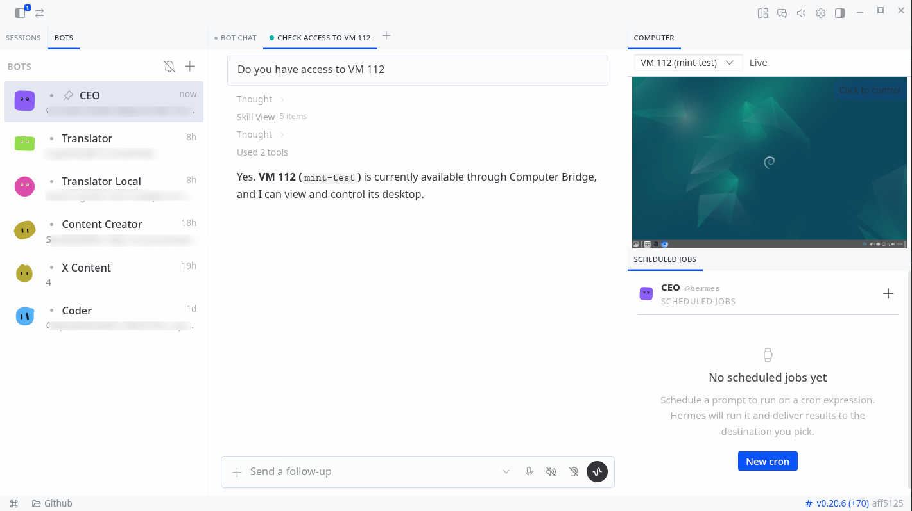

# hermes-computer-bridge

A Hermes Desktop plugin that gives Hermes agents a live view of a screen and
the ability to control it. The local desktop is captured through
`xdg-desktop-portal`, so it works the same on Wayland (KDE, GNOME, COSMIC,
Sway, Hyprland) and on X11, because it asks the portal what it can do instead
of branching on which desktop environment is running. The same panel can also
view and control a Proxmox virtual machine or any VNC server over RFB.



The panel mounts as a `Computer` tab in the right sidebar, docked directly
above Cronjobs, and appears only while a bot chat is open.

## Why a portal

The reference plugin it replaces branches `if X11 / elif wlroots / else Xorg`
and falls over on a plain Wayland session. This one speaks one protocol,
`xdg-desktop-portal`, so a single code path covers every modern compositor.
X11 remains as a lower rung, not the foundation.

## Capability ladder

Capture and input each fall through an ordered ladder. A rung is validated by
use, not by a binary existing on `PATH`. A read fails through to the next rung
only when the capability is genuinely missing; a transient error is a bounded
retry, never a hot loop.

```
CAPTURE                            INPUT (local desktop)
1. portal ScreenCast (PipeWire)    1. uinput virtual device
2. wlr-screencopy                  2. wlroots virtual-pointer (wlrctl)
3. X11 SHM                         3. XTest (xdotool)
4. remote RFB (Proxmox or VNC)     remote: RFB pointer and key events
```

`screenshot`, `click`, `type`, `key`, `move`, `scroll`, and `drag` are one
small API over whichever rung answered. Local input goes through a `uinput`
virtual device, which needs no extra consent prompt and raises no
remote-control notification. Remote input is delivered as RFB pointer and key
events over the same VNC session that carries the picture, which streams as
incremental, zlib-compressed updates over a persistent framebuffer so only the
changed regions travel the wire.

## Targets and per-bot binding

The panel has a target dropdown:

- `Off` (default): no stream, nothing captured.
- `Local desktop`: the machine Hermes runs on.
- One entry per running Proxmox VM (for example `VM 112`).
- One entry per saved VNC server (any host, LAN or remote).
- `Connect to new...`: a form to add a **VNC server** (host, port, optional
  password) or a **Proxmox host** (URL, API token, node). Secrets are written
  under `$XDG_STATE_HOME/hermes-computer-bridge/` (mode 0600) and never enter
  git.

The chosen target is remembered per bot. Selecting a remote streams it live in
the pane; clicking the preview opens a full interactive window where you drive
it with mouse and keyboard (close with the button or Esc). Inside the window,
`Ctrl+V` pastes the host clipboard into the target and `Copy from VM` pulls the
target's clipboard back, so passwords and long strings do not have to be
retyped.

When the agent acts on a target, the panel follows it automatically: work on a
VM switches the view to that VM, work on the local desktop switches it back.

## Viewing a Windows or macOS host

`Local desktop` capture (portal ScreenCast + uinput) is Linux only. To view and
control a Windows or macOS machine, run a VNC server on it and add it as a VNC
target (`127.0.0.1:5900` for the local host, or its LAN address). The `connect/`
scripts set this up:

- `connect/connect-macos.sh` enables the built-in macOS Screen Sharing and sets
  a VNC password. No third-party install, since macOS ships a VNC server.
- `connect/connect-windows.ps1` installs a VNC server (TightVNC) via `winget`,
  since Windows has no built-in one.

Both are unverified on their target OS (this is developed on Linux); treat them
as a starting point.

## Agent tools

The agent reaches the same targets without the human touching the panel. Every
control tool takes an optional `target` (`local` by default, or `vm:<id>`):

- `computer_bridge_targets`: list the local desktop and every running VM.
- `computer_bridge_screenshot`, `computer_bridge_status`.
- `computer_bridge_click`, `computer_bridge_type`, `computer_bridge_key`,
  `computer_bridge_move`, `computer_bridge_scroll`, `computer_bridge_drag`.

A VM target opens its own VNC session for the agent, independent of what the
panel is showing, so the bot can drive a VM autonomously.

## Consent and tokens

The KDE ScreenCast consent prompt cannot be bypassed; that is the Wayland
security model. `persist_mode=2` plus a `restore_token` stored under
`$XDG_STATE_HOME/hermes-computer-bridge/` reduces it to once per session or
until you revoke it. The token never enters git. Local input uses `uinput`
and needs no consent prompt of its own.

## Requirements

The capture helper needs the system Python with the GObject introspection and
GStreamer bindings (`gi`, `Gst`), which cannot be installed sensibly into a
venv. The plugin itself runs inside the Hermes venv and calls the helper as a
subprocess, so the venv and the agent never import `gi`.

| Runtime                    | gi  | Gst / pipewiresrc | Unix FD from the portal |
| -------------------------- | --- | ----------------- | ----------------------- |
| `/usr/bin/python3` (3.14)  | yes | yes               | yes                     |
| Hermes venv (3.11)         | no  | no                | no                      |

Local input needs write access to `/dev/uinput`. VM control needs `httpx` and
`websockets` in the Hermes venv (both ship with it).

## Install

The repo is the source of truth; installation is a symlink, so `git pull` is
the whole update.

```bash
python3 scripts/install_dev.py --profile default   # idempotent symlink into ~/.hermes/plugins/
hermes plugins enable hermes-computer-bridge         # the official enable gate
# then restart Hermes Desktop; plugin routers mount once, at startup
```

The script never touches `config.yaml` and refuses to overwrite a real
directory. `scripts/install_dev.py --uninstall` removes only the symlink.
Validate the install with the official tool:

```bash
hermes plugins doctor . --ci
```

## HTTP surface

| Method | Path               | Purpose                                                    |
| ------ | ------------------ | ---------------------------------------------------------- |
| GET    | `/status`          | which rung would serve, outputs, live and agent target     |
| GET    | `/streams`         | compositor outputs (the portal reveals streams in-session) |
| GET    | `/targets`         | local desktop plus every running Proxmox VM                |
| POST   | `/live/start`      | open the session and stream the chosen target              |
| POST   | `/live/stop`       | stop the stream and close the session                      |
| GET    | `/live/status`     | running, fps, frames seen, blank flag, last error, uptime  |
| POST   | `/input`           | forward one input op to the local ladder or the remote     |
| GET    | `/clipboard`       | the remote target's clipboard text                         |
| POST   | `/clipboard`       | set the remote target's clipboard text                     |
| GET    | `/config/vnc`      | saved VNC endpoints (passwords masked)                     |
| POST   | `/config/vnc`      | add or update a VNC endpoint                               |
| GET    | `/frame-data`      | newest frame as a JSON data URL (polling fallback)         |
| POST   | `/capture`         | one frame through the ladder (single-shot escape hatch)    |
| GET    | `/map`             | frame pixel to logical point, or null in a dead band       |
| GET    | `/binding`         | the per-bot target bindings                                |
| POST   | `/binding`         | store a target for a bot profile                           |
| GET    | `/config/proxmox`  | Proxmox host and node (token masked)                       |
| POST   | `/config/proxmox`  | write the Proxmox config file (0600)                       |

Frames also arrive over the plugin WebSocket (`/events`) as they are
produced. `ctx.rest` stays JSON-only and `ctx.socket` is a no-op on OAuth
remotes, so the polling path is always available.

## Development

```bash
/usr/bin/python3 -m pytest -q      # runs headless, no graphical session, no portal
node --check desktop/plugin.js
```

Two interpreters are deliberate: `pytest` lives in the system Python (where
`gi` is), while `fastapi` and `uvicorn` live in the Hermes venv (where the
gateway imports `plugin_api.py`). The one test that needs a real frame is the
portal spike, which requires clicking the KDE consent dialog:

```bash
/usr/bin/python3 helpers/portal_screencast.py spike --output evidence/frame.png
/usr/bin/python3 scripts/validate_frame.py evidence/frame.png
```

## License

MIT. See `LICENSE`.
